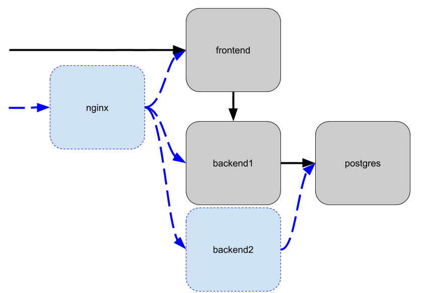

# Лабораторная по теме Docker

В данном репозитории представлен макет приложения с трехуровневой архитектурой.
Каждый уровень (сервис) вынесен отдельный подкаталог.

В реальном мире сервисы работают на разных серверах и ими занимаются разные команды.
При этом, для удобства разработки, они упакованы в контейнеры, чтобы можно было все запустить локально и отладить.
Также в корне репозитория лежат скрипты для сборки, запуска и остановки контейнеров.

Текущее взаимодействие показано на рисунке черными стрелками.

У текущей схемы есть проблемы
 - сервису фронтенда приходится брать на себя проксирование запросов к апи.
 - сервис бэкенда может работать только в одном экземпляре, так как текущее проксирование фронтендом не подразумевает балансировки нагрузки

Задача - настроить в макете обратный прокси с балансировкой нагрузки и запустить как минимум 2 копии бэкенда.

Примечание: здесь мы для наглядности используем не встроенный в docker-compose механизм масштабирования, 
а просто запуск двух одинаковых контейнеров.

Решение:
1. Изучите docker-compose.yml. Что делает каждая из директив? Чем отличаются 3 варианта использования volumes?
2. Изучите Dockerfile в каждом из сервисов. Что делает каждая из директив? Что означает повторение директивы FROM? Чем RUN отличается от CMD?
3. Изучите скрипты сборки, запуска и остановки. За что отвечает каждый из параметров команды docker-compose?
3. Запустите все контейнеры и убедитесь что приложение работает. Выведите на экран логи каждого контейнера.

    Для проверки работы вам нужно обратиться к сервису frontend, он доступен по ссылке http://localhost:22002/

    Обратите внимание на строку `Backend-Container` которая показывает какой контейнер обслуживает API.
    Сейчас она не меняется при перезагрузке страницы, потому что сервис один.
    
    Обратите внимание на строки `Frontend-Proxy: None` - запросы в фронтенд не проксируются,
    `Backend-Proxy: Node.js` - запросы в бэкенд проксируются через фронтенд.

    Также для проверки работы отдельно бэкенда можно обратиться по урлу http://localhost:22003/api/info

    Тут можно увидеть что в строке `Backend-Container` всегда значение `backend1` из конфига.
    
    Для проверки работы отдельно базы данных можно подключиться утилитой pgadmin по адресу localhost:22001

4. Напишите Dockerfile для сервиса nginx. Добавьте сервис в docker-compose.yml.

    Конфигурация для nginx уже написана, достаточно собрать файлы в контейнер.
    
    При добавлении контейнера примонтируйте файл `nginx-data/upstreams.conf` рядом с `default.conf`.
    В нем содержатся ссылки на серверы для проксирования и настройки балансировки.
    
5. Запустите сервис nginx. Проверьте что он отвечает по ссылке http://localhost:22000/

    Обратите внимание, что строки `Frontend-Proxy` и `Backend-Proxy` изменились.
    Какие стрелки на схеме теперь работают, а какие нет?

6. Добавьте сервис backend2 в docker-compose.yml. Запустите его.

    Проверьте его работу по урлу http://localhost:22004/api/info
    
    Тут можно увидеть что в строке `Backend-Container` всегда значение `backend2` из конфига.

7. Настройте балансировку в конфиге upstreams.conf и перезапустите контейнер nginx.

    Проверьте что он отвечает по ссылке http://localhost:22000/
    
    Если все сделано правильно, то теперь при перезагрузке страницы 
    меняется значение в строке `Backend-Container`.
    Это означает, что попеременно используются контейнеры backend1 и backend2.
